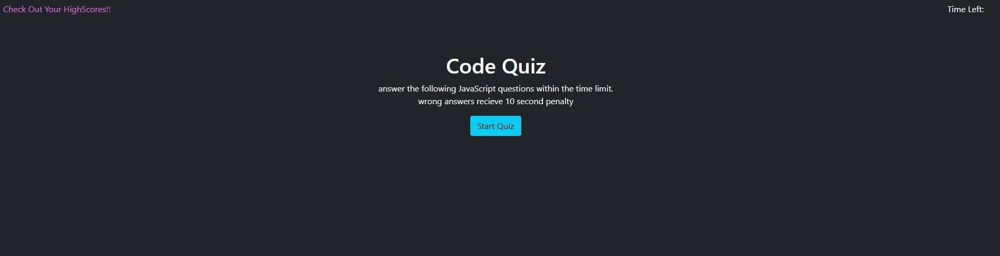

# javascript-code-quiz
## Requirements
GIVEN I am taking a code quiz 
WHEN I click the start button 
THEN a timer starts and I am presented with a question 
WHEN I answer a question 
THEN I am presented with another question 
WHEN I answer a question incorrectly 
THEN time is subtracted from the clock 
WHEN all questions are answered or the timer reaches 0 
THEN the game is over 
WHEN the game is over 
THEN I can save my initials and score 
## Files & directories

-javascript-code-quiz  
  -assets  
    -css  
      -style.css  
    -js  
      -score.js 
      -script.js 
    -screenshots  
      -codequiz.png 
    -index.html  
    -highscore.html  
    -README.md  

## Project Notes

this project was created with javascript and web APIs, and tests the user on javascript knowledge

## Screenshots

## Link

[link](https://valiantthor92.github.io/javascript-code-quiz/index.html)

## Credits

-Travis Nelson (student)